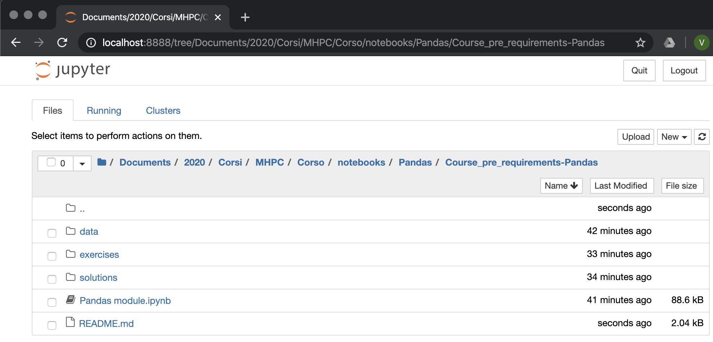
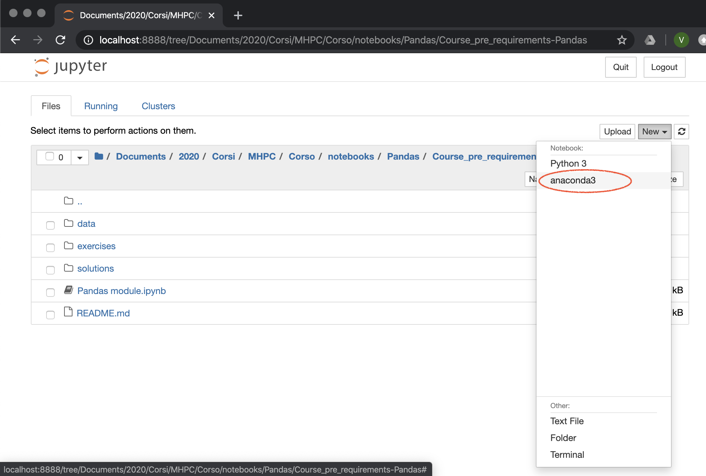
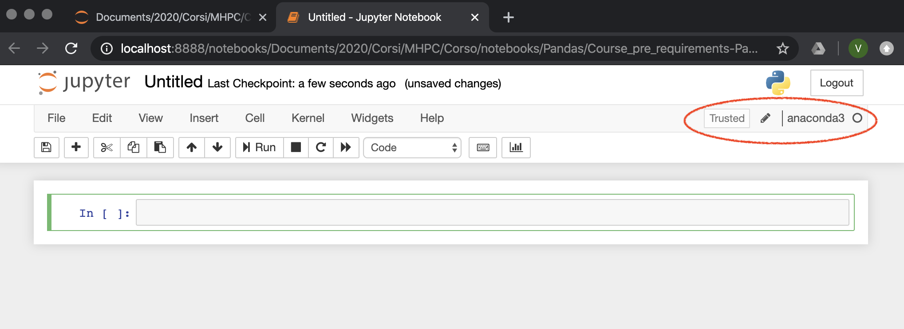

# Required software


For the course you have to install the latest release of Anaconda 3.
You can download the package from [Anaconda](!https://www.anaconda.com/products/individual) webpage.

After installation a new block will appear in your bashrc/bashprofile/zprofile ect... depending on your OS (for windows you don't have to check any file):

```
# >>> conda initialize >>>
# !! Contents within this block are managed by 'conda init' !!
__conda_setup="$('/Users/consortiv/anaconda3/bin/conda' 'shell.bash' 'hook' 2> /dev/null)"
if [ $? -eq 0 ]; then
    eval "$__conda_setup"
else
    if [ -f "/Users/consortiv/anaconda3/etc/profile.d/conda.sh" ]; then
        . "/Users/consortiv/anaconda3/etc/profile.d/conda.sh"
    else
        export PATH="/Users/consortiv/anaconda3/bin:$PATH"
    fi
fi
unset __conda_setup
# <<< conda initialize <<<
```

After installation check if the command `conda` is available in your shell.

# Setup the environment

A best practice to work with python is to always create dedicated environments for each project. Working with environments is extremely helpful to

- ensure code reproducibility
- avoid conflicts between different releases of packages

Anaconda as well as python has its own environment setting. For the course it is necessary to install a specific environment that we will call "anaconda3".

Open the shell/bash (for windows user after the installation of anaconda will be available "Anaconda Prompt" or "Anaconda Powershell") and type following commands:

```
$ conda create --name anaconda3 python=3 anaconda
$ conda activate anaconda3
$ python -m ipykernel install --user --name anaconda3 --display-name "anaconda3"
```
This will create an environment caled "anaconda3" with python 3 and a compete instalation of anaconda. In the last step the python kernel is installed in ipython and will be available in jupyter notebook which is the development tool that we will use during lectures.

After this step try to lauch jupyter notebook:

```
$ jupyter notebook
```

The browser will be launched after few secconds and the jupyter notebook *navgation screan* will appear


Try to create a new notebook loading the environment "anaconda3"



If the kernel is ready and that no error messages appers in the terminal and you are there!



***JUPYTER NOTEBOOK SET THE BASE FOLDER WHERE IT HAS BEEN LUNCHED IN THE FIRST PLACE. MAKES SHURE THAT THE COURSE MATERIAL IS REACHABLE FROM THE LOCATION WHERE YOU LOUNCH THE NOTEBOOK OR YOU WON'T BE ABLE TO LOAD IT. FROM THE BASE FOLDER YOU ARE ONLY ALLOWED TO NAVIGATE SUB-FOLDERS AND NOT TO MOVE BACK TO A PARENT FOLDER OF THE BASE FOLDER (cd ```cd ..``` is not working from jupyter notebook navigation screan)***


# Setup the pandas crash course: 0\_pandas\_module.ipynb


The crash course notebook ```0_pandas_module.ipynb``` is expecting to find a folder ../data containing data and pictures used in the notebook. These data can be find [here](!https://drive.google.com/drive/folders/1A5_XfWA3mebLdxL81fuxF5WFimEyU64Z?usp=sharing). You are required to download them and copy them in the folder ```data``` present in the root folder of the git repository.